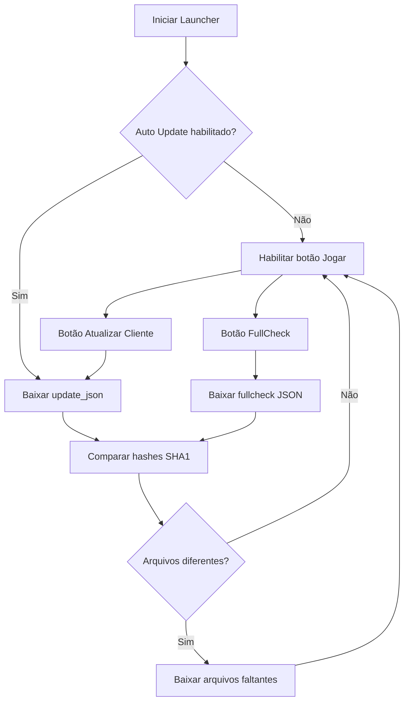

# Lineage 2 Grand Crusade – Launcher & Updater

Launcher em **Python + PyQt5** para o Lineage 2 Grand Crusade, com:

- Tela personalizada com arte e moldura no estilo do L2  
- Atualização automática do cliente ao abrir o launcher  
- Botões de **Atualizar Cliente**, **Full Check** e **JOGAR**  
- Log separado em janela própria  
- Sistema de update via HTTP (servidor web simples)

---
teste 
## Contribuição e Fluxo de Pull Requests

Este projeto é livre para qualquer usuário baixar, clonar, abrir issues, e criar branches/forks contendo soluções.

**Regras para Pull Requests:**
- Todos os pull requests (PRs) devem ser enviados para a branch `homologacao`.
- PRs para a branch `main` não serão aceitos diretamente.
- Apenas o mantenedor ([@Tkenai](https://github.com/Tkenai)) pode aprovar e fazer merge de PRs para a branch principal (`main`), após homologação.
- Após validação na `homologacao`, será criado um PR de homologação para `main`.


**Política para criação de branches**
- Crie sempre uma `issue` antes de iniciar uma alteração.
- As branches devem ser nomeadas com o prefixo do número da issue, exemplo: `issue-12-corrige-bug-login`.
- Pull requests sem vinculação a uma issue podem ser recusados.

- **Licença**
Este projeto está licenciado sob os termos da [GNU General Public License v3.0](LICENSE).

---

## ⚠️ Arquivos que você *sempre* deve ajustar ao mudar IP / hostname

Quando trocar o IP ou o nome do servidor web, lembre-se de atualizar:

1. **`config.json`** (na raiz do projeto)  
   - Campos dentro de `"paths"`:
     - `update_json`
     - `fullcheck_json`
     - `news_url` (se usar notícias online)
2. **Arquivos JSON no servidor web (pasta `www`)**
   - `www/l2updater/update_json_url.json`
   - `www/l2updater/fullcheck.json`  
   (se esses arquivos tiverem URLs absolutas ou caminhos de base)

> Regra de ouro: qualquer URL começando com `http://` ou `https://` precisa ser revisada quando o servidor mudar.

---

## 📁 Estrutura do projeto

Estrutura sugerida da raiz do projeto:

```text
launcher_complete/
│
├── app/
│   ├── main_window.py
│   ├── updater_window.py
│   └── windows_privileges.py
│
├── assets/
│   ├── launcher_bg.png
│   └── gimp image for edit with border.png
│
├── logs/
│   └── launcher.log
│
├── www/                          ← Servidor Web (HTTP)
│   └── l2updater/
│       ├── client/              ← Cliente completo do Lineage 2
│       ├── fullcheck.json
│       └── update_json_url.json
│
├── config.json
├── main.py
└── README.md
```
---




---
# Como Recompilar o Launcher para EXE (PyInstaller)

1. Instalar dependências    
    pip install pyinstaller pyqt5

2. Gerar EXE com ícone e sem console  
   pyinstaller ^
       --noconsole --noconfirm --name "L2Launcher" --icon=assets/icon.ico --add-data "assets;assets" --add-data "www;www" main.py
3. Arquivos gerados
    /dist/L2Launcher/L2Launcher.exe